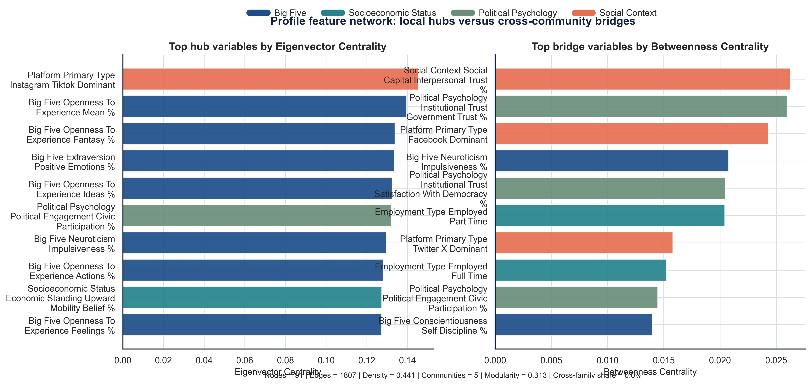
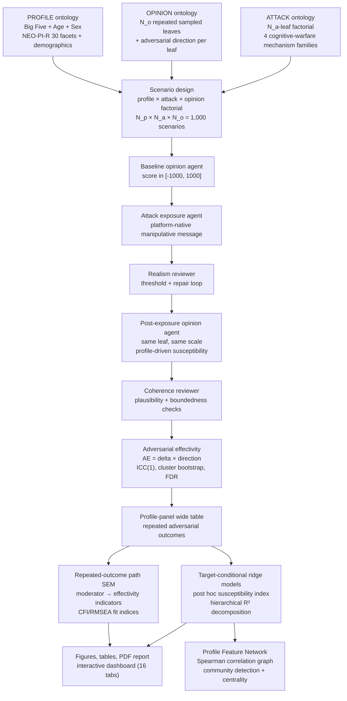

<div align="center">

# Inter-individual Differences in Susceptibility to Cyber-manipulation

### Ontology-Constrained Multi-Agent Simulation for Adversarial Opinion Susceptibility Auditing

[](research_report/report/main.pdf)
[](LICENSE)
[](https://www.python.org/)
[](docker/)

**Stijn Van Severen<sup>1,*</sup> · Thomas De Schryver<sup>1</sup> · Mira Ostyn<sup>1</sup>**

<sup>1</sup> Ghent University · <sup>*</sup> Corresponding author

---

</div>

## Table of Contents

- [Abstract](#abstract)
- [Key Findings](#key-findings)
- [Full Paper](#full-paper)
- [Repository Structure](#repository-structure)
- [Setup & Installation](#setup--installation)
- [Usage](#usage)
- [Pipeline Overview](#pipeline-overview)
- [Conditional Susceptibility Index](#conditional-susceptibility-index)
- [Custom Ontology Support](#-custom-ontology-support)
- [Citation](#citation)
- [License](#license)

---

## Abstract

This repository contains the backend research pipeline, evaluation outputs, manuscript assets, and reproducible report for a study on how **inter-individual differences moderate the effectivity of cyber-manipulation** in political opinion spaces. The workflow represents `PROFILE`, `ATTACK`, and `OPINION` as explicit hierarchical ontologies, generates attacked-only profile-panel scenarios, elicits baseline and post-exposure opinions with structured LLM agents, audits exposure realism and response coherence, and estimates moderation through a **repeated-outcome path SEM** plus a **post hoc ridge-regularised susceptibility index**.

The present study focuses on three core profile dimensions — **Personality (Big Five + NEO-PI-R facets), Age, and Sex** — as primary moderators of adversarial opinion susceptibility, examined across a full factorial design of attack mechanisms and opinion domains.

> **Interpretive constraint:** Among attacked pseudoprofiles, which profile differences are associated with larger post-minus-baseline opinion shifts — in the direction of a hypothetical adversary's goal — across repeated political opinion leaves and multiple attack mechanisms? The design is attacked-only: it does **not** estimate a no-attack counterfactual effect.

---

## Key Findings

> **Main result:** *N_p* = **25 pseudoprofiles** × *N_a* = **4 attack vectors** × *N_o* = **10 opinion leaves** across 4 political domains = **1,000 scenarios**. Attack vectors: one per cognitive-warfare mechanism family (Misleading Narrative Framing, Astroturf Comment Wave, Fear Appeal Scapegoating, LLM Chatbot Personalized Persuasion). Primary profile dimensions: **Big Five personality (30 facets) + Age + Sex** — survey-mappable to ESS/Eurobarometer/ANES/GSS. Post-attack opinion agent: **profile-driven susceptibility** — no explicit directional % constraints; trait-outcome linkages govern shifting behaviour (Conscientiousness → deliberate resistance; Neuroticism → emotional reactivity).

### Headline Results

| Metric | Value |
|--------|-------|
| *N* (scenarios) | 25 × 4 × 10 = **1,000** |
| Primary profile dimensions | **Big Five personality (30 facets) + Age + Sex** |
| Attack vectors | 4 (one per cognitive-warfare mechanism family) |
| Opinion domains | 4 (10 leaves sampled, ESS-relevant policy topics) |
| ICC(1) \|Δ\| | 0.011 (attack–opinion context dominates; profile contributes ~1%) |
| SEM fit | CFI = 1.000, RMSEA = 0.000, GFI = 0.9995 |
| **Profile network: nodes** | **91** features (hierarchical mixed continuous + categorical) |
| **Profile network: edges** | **1,807** (Spearman \|ρ\| ≥ 0.15) |
| **Profile network: density** | **0.441** |
| **Profile network: communities** | **5** (greedy modularity, Q = 0.313) |
| **Strongest SEM path** | Big Five Conscientiousness → Δ (β = −8.82, *p* = .018) |

### Methodological Position

- **Full-factorial multi-domain design**: *N_a* attack leaves × *N_o* opinion leaves per profile across 4 political domains — enables cross-attack and cross-domain comparison of susceptibility moderators
- Effectivity is **directional**: each opinion leaf carries an adversarial goal direction (`±1`); `AE = signed_delta × direction`
- **Profile-driven opinion prompt**: no hard % constraints — Conscientiousness → deliberate resistance; Neuroticism → emotional reactivity; Extraversion → social susceptibility; Institutional Trust → authority-cue sensitivity
- The SEM is a **profile-level repeated-outcome path model** with multiple adversarial effectivity indicators
- **Three-estimator moderation stack**: (1) **Ridge** on all profile features — primary effect estimator; (2) **Elastic Net / LASSO** — feature selector; (3) **OLS** (Big Five benchmark)
- **Profile feature network analysis**: Spearman correlation network → eigenvector/betweenness/degree/closeness/PageRank + community detection; centrality = hub-and-spoke influence structure of the profile feature space
- The susceptibility index is computed **post hoc** from target-conditional ridge task models with **hierarchical R² decomposition**
- **Cluster bootstrap** at the profile level (B = 200) preserves within-profile dependence
- Fully auditable provenance across all 9 pipeline stages

### Main Results

<div align="center">


*Figure 1. Profile feature network — top hub variables by weighted degree (left) and top bridge variables by participation coefficient (right). Colours encode ontology family. Big Five Openness facets and Age emerge as the leading hub nodes; participation coefficient identifies features that span community boundaries in the hierarchical mixed continuous-plus-categorical feature graph.*
</div>

<div align="center">


*Figure 2. Task reliability surface — reliability weights (proportional to n / CV-MSE) across the attack × opinion factorial. Narrow weight dispersion confirms that no single cell dominates the conditional susceptibility ranking; the estimator is robust to task heterogeneity.*
</div>

---

## Full Paper

- **PDF (typeset):** [research_report/report/main.pdf](research_report/report/main.pdf)
- **LaTeX source:** [research_report/report/main.tex](research_report/report/main.tex)
- **Paper assets:** [research_report/assets](research_report/assets)
- **Interactive dashboard:** generated locally at `evaluation/run_10/stage_outputs/07_generate_research_visuals/interactive_sem_dashboard.html` (run the pipeline to produce)

---

## Repository Structure

```text
Paper_CaseStudiesAnalysisExperimentalData/
├── README.md
├── LICENSE
├── CITATION.cff
├── requirements.txt
├── .env.example
├── .gitignore
│
├── docker/
│   ├── Dockerfile
│   ├── docker-compose.yml
│   └── entrypoint.sh
│
├── evaluation/
│   └── run_10/                          # Current study outputs (1,000 scenarios)
│       ├── stage_outputs/               # Per-stage artefacts (01–09)
│       ├── paper/                       # Publication assets mirror
│       └── logs/                        # Stage logs
│
├── research_report/
│   ├── assets/
│   │   ├── figures/                     # PNG/PDF manuscript figures
│   │   └── tables/                      # CSV/TeX supplementary tables
│   └── report/
│       ├── main.tex                     # LaTeX source (APA 7)
│       ├── references.bib               # BibTeX references (15 entries, DOIs verified)
│       └── main.pdf                     # Compiled manuscript
│
└── src/
    └── backend/
        ├── agentic_framework/           # OpenRouter client, agents, prompts, repair logic
        ├── ontology/separate/test/      # PROFILE / ATTACK / OPINION ontologies
        ├── pipeline/full/               # Orchestrator (run_full_pipeline.py)
        ├── pipeline/separate/           # Per-stage scripts (01–09)
        └── utils/                       # Dashboard, publication assets, SEM, network, etc.
```

---

## Setup & Installation

### Option A — Local

```bash
git clone https://github.com/stvsever/research_paper_on_cognitive_sovereignity.git
cd research_paper_on_cognitive_sovereignity
python3.12 -m venv .venv && source .venv/bin/activate
pip install --upgrade pip && pip install -r requirements.txt
cp .env.example .env   # add OPENROUTER_API_KEY
```

### Option B — Docker

```bash
git clone https://github.com/stvsever/research_paper_on_cognitive_sovereignity.git
cd research_paper_on_cognitive_sovereignity
cp .env.example .env   # add OPENROUTER_API_KEY
cd docker
OPENROUTER_MODEL=mistralai/mistral-small-3.2-24b-instruct docker compose up --build
```

---

## Usage

### Reproduce the full study

```bash
bash scripts/run_10.sh
```

### Run the full pipeline manually

```bash
.venv/bin/python src/backend/pipeline/full/run_full_pipeline.py \
  --output-root evaluation/run_10 \
  --run-id run_10 \
  --n-profiles 25 \
  --seed 100 \
  --attack-ratio 1.0 \
  --attack-leaves "Misleading_Narrative_Framing,Astroturf_Comment_Wave,Fear_Appeal_Scapegoating_Post,LLM_Chatbot_Personalized_Persuasion" \
  --max-opinion-leaves 10 \
  --use-test-ontology \
  --ontology-root src/backend/ontology/separate/test \
  --openrouter-model mistralai/mistral-small-3.2-24b-instruct \
  --temperature 0.15 \
  --bootstrap-samples 200 \
  --generate-visuals --export-static-figures --build-report
```

### Rebuild analytics / visuals / paper only (no LLM calls)

```bash
.venv/bin/python src/backend/pipeline/full/run_full_pipeline.py \
  --output-root evaluation/run_10 --run-id run_10 \
  --n-profiles 25 --seed 100 --attack-ratio 1.0 \
  --attack-leaves "Misleading_Narrative_Framing,Astroturf_Comment_Wave,Fear_Appeal_Scapegoating_Post,LLM_Chatbot_Personalized_Persuasion" \
  --max-opinion-leaves 10 --use-test-ontology \
  --ontology-root src/backend/ontology/separate/test \
  --openrouter-model mistralai/mistral-small-3.2-24b-instruct \
  --temperature 0.15 --bootstrap-samples 200 \
  --generate-visuals --export-static-figures --build-report \
  --resume-from-stage 06 --stop-after-stage 09
```

### Run individual stages

Stages under `src/backend/pipeline/separate/` are independently runnable:

`01_create_scenarios` → `02_assess_baseline_opinions` → `03_run_opinion_attacks` → `04_assess_post_attack_opinions` → `05_compute_effectivity_deltas` → `06_construct_structural_equation_model` → `07_generate_research_visuals` → `08_generate_publication_assets` → `09_build_research_report`

---

## Pipeline Overview



---

## Conditional Susceptibility Index

The profile-level susceptibility index is **directional** and **conditional** on the configured (attack, opinion) target set *T*.

### Adversarial Effectivity

```
AE_ik = (post_score_ik − baseline_score_ik) × direction_k

direction_k ∈ {+1, −1, 0}  (from OPINION ontology; 0 = excluded)
```

### Conditional Index

For each task *t ∈ T*, a ridge model is fit:

```
Ê_it = β̂_0t + Σ_j β̂_jt · X_ij

S_i(T) = Σ_t  w_t · Ê_it          (reliability-weighted aggregate)
CSI_i(T) = percentile_rank(S_i(T))
w_t ∝ n_t / CV-MSE_t
```

Higher CSI = model expects opinion movement more strongly aligned with the adversary's goal for that profile under the configured *T*.

### Score a new profile

```bash
python src/backend/pipeline/separate/compute_conditional_susceptibility/score_profile.py \
  --artifact-path evaluation/run_10/stage_outputs/06_construct_structural_equation_model/conditional_susceptibility_artifact.json \
  --age 34 --sex Male --neuroticism-pct 75 --conscientiousness-pct 20 --extraversion-pct 85
```

---

## 🧩 Custom Ontology Support

Analysts can run the full pipeline with **their own PROFILE × ATTACK × OPINION taxonomies** (3 JSON files):

```bash
# Validate your ontologies
python -m src.backend.user_ontology.cli \
  --profile-json path/to/profile.json \
  --attack-json  path/to/attack.json  \
  --opinion-json path/to/opinion.json \
  --validate-only

# Run with custom ontologies
python -m src.backend.user_ontology.cli \
  --profile-json path/to/profile.json \
  --attack-json  path/to/attack.json  \
  --opinion-json path/to/opinion.json \
  --run-id my_analysis \
  --n-profiles 40 \
  --openrouter-model mistralai/mistral-small-3.2-24b-instruct
```

### Semantic Embedding

All ontology leaves can be embedded and projected to 2D via UMAP:

```python
from src.backend.utils.semantic_embedding import embed_ontology
artifact = embed_ontology(
    ontology_root="src/backend/ontology/separate/test",
    out_dir="evaluation/run_10/embeddings",
    n_clusters=8,
)
```

Results load automatically into the interactive dashboard (Ontologies → Semantic Embedding Space tab).

---

## Dashboard Tabs

The interactive dashboard (`interactive_sem_dashboard.html`) provides 16 tabs:

| Tab | Description |
|-----|-------------|
| 🗂 **Ontology Explorer** | Ontology leaf inventory with optional UMAP semantic embedding |
| 📡 **Factorial 3D Surface** | Dual 3D surface: mean AE and SD(AE) across attack × opinion |
| 📡 **Factorial Heat + Contour** | Side-by-side annotated heatmaps with contour lines |
| 🧠 **SEM Network** | Hierarchical 3D path diagram with layer toggles and p-value threshold |
| 🧠 **SEM Heatmap** | Coefficient matrix: moderator × opinion indicator |
| 🔬 **Conditional Susceptibility Estimator** | Profile configurator + bootstrap rank uncertainty |
| 👤 **Susceptibility Map** | Profile-level AE sorted by susceptibility index |
| 👤 **Profile Heatmap** | Profile × opinion leaf adversarial effectivity grid |
| 📊 **Moderator Forest** | Ridge / EN / OLS comparison forest plot |
| 📊 **Hierarchical Importance** | Random Forest importance by ontology-aligned feature group |
| 📈 **Distribution by Opinion Leaf** | Per-leaf Δ and AE violin/box plots |
| 📈 **Distribution by Attack Vector** | Per-attack Δ and AE distributions |
| 📈 **Score Trajectory** | Baseline → post-exposure opinion shift per profile |
| 🌐 **Profile Feature Network** | Interactive Spearman correlation graph (see below) |
| 🔎 **Audit & Robustness** | Bootstrap rank stability, SEM sensitivity, methodology audit |
| 📋 **Task Reliability** | Reliability weight surface across attack × opinion cells |

### Profile Feature Network — interaction guide

The network tab renders the full **91-node, 1,807-edge** Spearman correlation graph of profile features with community structure (Q = 0.313):

- **Circles** = continuous trait features · **Diamonds** = categorical / dummy features
- **Force-directed layout** — drag nodes to pin/reposition; press `P` to toggle physics
- **Wheel zoom** + **background drag** for pan/zoom
- **Shift + drag** = lasso multi-select → local metrics aggregate in side panel
- **Shortest-path mode** (toolbar button) — click source, then target → BFS path highlighted
- **Community convex hulls** — press `H` to toggle coloured community boundaries
- **Filters**: ontology family · community · feature type (continuous/categorical) · edge sign (positive/negative correlation)
- **Hub / bridge presets** — one-click highlight of top-10 hub or bridge nodes
- **Global metrics panel** — density, modularity, avg clustering, transitivity, diameter
- **Local node tooltip** — degree, strength, eigenvector centrality, PageRank, betweenness, closeness, participation coefficient, bridge ratio, within-module Z, k-core index
- **Mini-map** — overview of full graph with current viewport box
- **SVG export** — download current view
- Keyboard: `R` = reset layout · `H` = hulls · `F` = fit to view · `P` = physics · `Esc` = deselect

---

## Citation

### APA 7

> Van Severen, S., De Schryver, T., & Ostyn, M. (2026). *Inter-individual differences in susceptibility to cyber-manipulation: A multi-agent simulation approach with high-dimensional state space of political opinions*. Ghent University. https://github.com/stvsever/research_paper_on_cognitive_sovereignity

### BibTeX

```bibtex
@article{vanseveren2026cybersusceptibility,
  title     = {Inter-individual Differences in Susceptibility to Cyber-manipulation:
               A Multi-agent Simulation Approach with High-dimensional State Space
               of Political Opinions},
  author    = {Van Severen, Stijn and De Schryver, Thomas and Ostyn, Mira},
  year      = {2026},
  institution = {Ghent University},
  url       = {https://github.com/stvsever/research_paper_on_cognitive_sovereignity}
}
```

A machine-readable citation is also available in [`CITATION.cff`](CITATION.cff).

---

## License

This project is licensed under the **MIT License** — see the [LICENSE](LICENSE) file for details.

---

<div align="center">

Built at **Ghent University** for the course *Case Studies in the Analysis of Experimental Data*

</div>
