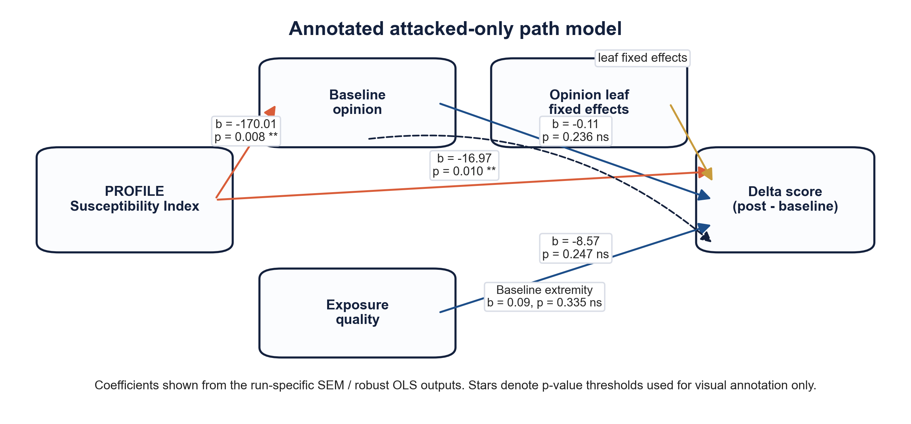
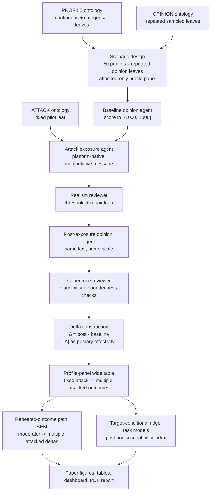

<div align="center">

# Inter-individual Differences in Susceptibility to Cyber-manipulation

### Multi-agent Simulation Approach with High-dimensional State Space of Political Opinions

[](research_report/report/main.pdf)
[](LICENSE)
[](https://www.python.org/)
[](docker/)

**Stijn Van Severen<sup>1,*</sup> · Thomas De Schryver<sup>1</sup> · Mira Ostyn<sup>1</sup>**

<sup>1</sup> Ghent University · <sup>*</sup> Corresponding author

---

</div>

## 📋 Table of Contents

- [Abstract](#-abstract)
- [Key Pilot Findings](#-key-pilot-findings)
- [Full Paper](#-full-paper)
- [Repository Structure](#-repository-structure)
- [Setup & Installation](#-setup--installation)
- [Usage](#-usage)
- [Pipeline Overview](#-pipeline-overview)
- [Conditional Susceptibility Index](#-conditional-susceptibility-index)
- [Figures & Tables](#-figures--tables)
- [Citation](#-citation)
- [License](#-license)

---

## 📝 Abstract

This repository contains the backend research pipeline, evaluation outputs, manuscript assets, and reproducible pilot report for a study on how **inter-individual differences moderate the effectivity of cyber-manipulation** in political opinion spaces. The workflow represents `PROFILE`, `ATTACK`, and `OPINION` as explicit hierarchical ontologies, generates attacked-only profile-panel scenarios, elicits baseline and post-exposure opinions with structured LLM agents, audits exposure realism and response coherence, and estimates moderation through a **repeated-outcome path SEM** plus a **post hoc ridge-regularized susceptibility index**.

The current codebase is a **methodological pilot**, not a claim-ready population study. Its purpose is to validate the architecture end to end: leaf-only ontology sampling, mixed-type profile construction, platform-native attack generation, repeated attacked opinion design, multivariate moderation estimation, target-conditional susceptibility scoring, interactive result inspection, publication-asset export, and automated LaTeX manuscript compilation.

> **Interpretive constraint:** the current main run (`run_6`) addresses a narrower and cleaner question than the earlier pilots: **among attacked pseudoprofiles, which profile differences are associated with larger post-minus-baseline opinion shifts across repeated political opinion leaves?** It does **not** estimate a no-attack counterfactual effect.

---

## 🔬 Key Pilot Findings

> **Main pilot result (`run_6`):** the attacked-only profile-panel run used **50 pseudoprofiles** crossed with **4 repeated opinion leaves** (`n = 200` attacked rows) under one fixed misinformation attack leaf. Mean absolute attacked shift was **41.65**, mean signed shift was **22.05**, mean attack realism was **0.69**, and mean post-exposure plausibility was **0.75**.

### Methodological Position of `run_6`

- one fixed ATTACK leaf is linked to **multiple attacked OPINION deltas** for each pseudoprofile
- the SEM is now a **profile-level repeated-outcome path model**, not a collapsed single-delta regression
- the personal susceptibility index is computed **after** the run from fitted moderator weights, not injected beforehand
- the final susceptibility ranking is stabilized with **target-conditional cross-validated ridge aggregation**, which is more defensible than using unstable small-sample multivariate OLS weights directly
- the pipeline remains fully auditable: baseline scores, exposure texts, realism review, post-exposure scores, coherence review, SEM outputs, figures, tables, and provenance are all saved

### `run_6` Headline Outputs

- **Profiles:** `50`
- **Attacked rows:** `200`
- **Repeated attacked outcomes per profile:** `4`
- **Mean |delta|:** `41.65`
- **Mean signed delta:** `22.05`
- **Mean attack realism:** `0.69`
- **Mean post-exposure plausibility:** `0.75`
- **Top descriptive susceptibility weights:** `Age Years (20.6%)`, `Sex Female (18.0%)`, `Big Five Neuroticism Mean % (14.9%)`, `Sex Other (10.6%)`
- **Most notable exploratory path-SEM signals:** `Sex Female -> Defense Spending Increase Support (b = -12.73, p = .018)`, `Big Five Neuroticism Mean % -> Conscription Support (b = 5.73, p = .031)`, `Sex Female -> Conscription Support (b = 13.59, p = .053)`

### Why `run_6` Is Stronger Than Earlier Pilots

- it directly matches the research question: moderation of **attacked opinion movement**, not treatment-versus-control contrast
- it preserves the logic that a **single attack vector** can influence **multiple opinion leaves** for the same individual
- it treats effectivity as an **absolute shift magnitude**, which avoids cancellation when attacked opinions move in different signed directions
- it separates **profile moderation estimation** from the **post hoc susceptibility index**, which is derived only after the repeated-outcome moderation structure is fit
- it pushes the repeated-leaf structure into the SEM itself rather than hiding it behind a single composite too early

### Main Figures

<div align="center">


*Figure 3. Descriptive susceptibility weights across profile moderators in `run_6`, showing how the post hoc susceptibility index is decomposed over age, sex, and personality terms under the modeled attack/opinion target set.*
</div>

<div align="center">


*Figure 4. Repeated-outcome path-SEM coefficients from profile moderators to attacked opinion shifts in `run_6`. The fixed ATTACK leaf is held constant by design; cells show how profile terms relate to each attacked opinion outcome.*
</div>

---

## 📖 Full Paper

The manuscript is built directly from the current pilot outputs:

- **PDF (typeset):** [research_report/report/main.pdf](research_report/report/main.pdf)
- **LaTeX source:** [research_report/report/main.tex](research_report/report/main.tex)
- **Report summary:** [research_report/report/report_summary.json](research_report/report/report_summary.json)
- **Paper assets:** [research_report/assets](research_report/assets)
- **Interactive dashboard (`run_6`):** generated locally at `evaluation/run_6/stage_outputs/07_generate_research_visuals/interactive_sem_dashboard.html` but intentionally not tracked in git to keep the repository lean

---

## 📁 Repository Structure

```text
Paper_CaseStudiesAnalysisExperimentalData/
├── README.md
├── LICENSE
├── CITATION.cff
├── requirements.txt
├── .env.example
├── .gitignore
│
├── docker/
│   ├── Dockerfile
│   ├── docker-compose.yml
│   └── entrypoint.sh
│
├── evaluation/
│   ├── run_1/                        # Initial mixed-condition pilot
│   ├── run_2/                        # Realism/coherence upgrades + dashboard
│   ├── run_3/                        # First publication bundle
│   ├── run_4/                        # Transitional redesign pilot
│   ├── run_5/                        # First attacked-only pilot
│   └── run_6/                        # Current 50-profile repeated-outcome pilot
│
├── research_report/
│   ├── assets/
│   │   ├── figures/                  # PNG/PDF manuscript figures
│   │   └── tables/                   # CSV/TeX manuscript tables
│   └── report/
│       ├── main.tex
│       ├── references.bib
│       └── main.pdf
│
└── src/
    ├── backend/
    │   ├── agentic_framework/        # OpenRouter client, agents, prompts, repair logic
    │   ├── ontology/
    │   │   └── separate/
    │   │       └── test/             # PROFILE / ATTACK / OPINION test ontologies
    │   ├── pipeline/
    │   │   ├── full/                 # Full orchestration entrypoint
    │   │   └── separate/             # Independently runnable stages 01-09
    │   ├── utils/                    # Ontology, SEM, visualization, and report utilities
    │   └── requirements.txt
    └── frontend/                     # Reserved for later interactive UI work
```

> **Note:** the repository is intentionally backend-first. The current primary deliverables are the attacked-only evaluation runs, the run 6 manuscript, and the reusable methodological pipeline.

---

## ⚙️ Setup & Installation

### 🔧 Option A — Local

```bash
# 1. Clone the repository
git clone https://github.com/stvsever/research_paper_on_cognitive_sovereignity.git
cd research_paper_on_cognitive_sovereignity

# 2. Create a virtual environment
python3.11 -m venv .venv
source .venv/bin/activate

# 3. Install dependencies
pip install --upgrade pip
pip install -r requirements.txt

# 4. Configure the environment
cp .env.example .env
# Add your OPENROUTER_API_KEY to .env
```

### 🐳 Option B — Docker

```bash
# 1. Clone the repository
git clone https://github.com/stvsever/research_paper_on_cognitive_sovereignity.git
cd research_paper_on_cognitive_sovereignity

# 2. Configure the environment
cp .env.example .env
# Add your OPENROUTER_API_KEY to .env

# 3. Launch the current pilot workflow
cd docker
OPENROUTER_MODEL=mistralai/mistral-small-3.2-24b-instruct docker compose up --build
```

By default, the Docker entrypoint runs the current pilot configuration for `evaluation/run_6/` and writes manuscript outputs to `research_report/report/`.

---

## 🚀 Usage

### Run the current full pilot pipeline locally

```bash
python src/backend/pipeline/full/run_full_pipeline.py \
  --output-root evaluation/run_6 \
  --run-id run_6 \
  --n-scenarios 200 \
  --n-profiles 50 \
  --seed 42 \
  --attack-ratio 1.0 \
  --attack-leaf "ATTACK_VECTORS > Social_Media_Misinformation > Misleading_Narrative_Framing" \
  --focus-opinion-domain Defense_and_National_Security \
  --max-opinion-leaves 4 \
  --profile-candidate-multiplier 5 \
  --use-test-ontology \
  --openrouter-model mistralai/mistral-small-3.2-24b-instruct \
  --temperature 0.15 \
  --max-repair-iter 2 \
  --profile-generation-mode deterministic \
  --self-supervise-attack-realism \
  --realism-threshold 0.76 \
  --self-supervise-opinion-coherence \
  --coherence-threshold 0.76 \
  --generate-visuals \
  --export-static-figures \
  --build-report \
  --bootstrap-samples 800 \
  --max-concurrency 50 \
  --paper-title "PILOT: Inter-individual Differences in Susceptibility to Cyber-manipulation: A Multi-agent Simulation Approach with High-dimensional State Space of Political Opinions" \
  --report-root research_report/report \
  --report-assets-root research_report/assets
```

### Run individual stages

Each stage under `src/backend/pipeline/separate/` is independently runnable:

- `01_create_scenarios`
- `02_assess_baseline_opinions`
- `03_run_opinion_attacks`
- `04_assess_post_attack_opinions`
- `05_compute_effectivity_deltas`
- `06_construct_structural_equation_model`
- `07_generate_research_visuals`
- `08_generate_publication_assets`
- `09_build_research_report`

---

## 🔄 Pipeline Overview



---

## 🧮 Conditional Susceptibility Index

For `run_7` and later, the profile-level susceptibility index is treated as **conditional on the attack vectors and opinion leaves that are actually being modeled**.

Let the configured target set be:

```text
T = {(attack_leaf, opinion_leaf)}
```

where each task is a specific `attack_leaf × opinion_leaf` combination included in the run.

For each task `t in T`, the pipeline fits a regularized profile-only model on attacked effectivity:

```text
A_hat_it = beta_hat_0t + sum over features j of [ beta_hat_jt * X_ij ]
```

Symbol definitions:

- `i` = profile index
- `t` = task index
- `t in T` means one specific `attack_leaf × opinion_leaf` target pair from the configured target set
- `A_hat_it` = predicted attacked effectivity for profile `i` on task `t`
- `beta_hat_0t` = fitted intercept for task `t`
- `beta_hat_jt` = fitted ridge coefficient for profile feature `j` in task `t`
- `X_ij` = encoded value of profile feature `j` for profile `i`

Current outcome definition:

- the default attacked effectivity target is `abs_delta_score = abs(post - baseline)`
- this means the task model predicts the magnitude of attacked opinion movement, not only signed direction

The conditional susceptibility score is then aggregated across the configured target set:

```text
S_i(T) = sum over tasks t in T of [ w_t * A_hat_it ]
```

Weight definitions:

- `S_i(T)` = aggregated conditional susceptibility score for profile `i` under target set `T`
- `w_t` = normalized weight assigned to task `t`
- `n_t` = number of observations available for task `t`
- `CV-MSE_t` = cross-validated mean squared prediction error for task `t`

Weighting logic:

- before normalization, task reliability is set proportional to:

```text
w_t_raw proportional to n_t / CV-MSE_t
```

- after that, the task weights are normalized across all tasks in `T`
- this means a task receives more influence when it has more data and lower out-of-sample error

and converted to a percentile rank within the scored profile set:

```text
CSI_i(T) = percentile_rank( S_i(T) )
```

Final index definition:

- `CSI_i(T)` = conditional susceptibility index for profile `i` under target set `T`
- `PctRank(.)` = percentile rank within the set of scored profiles
- higher `CSI_i(T)` means the fitted model expects larger attacked opinion movement for that profile under the configured attack/opinion target set

This design matters because in practice susceptibility should be interpreted **relative to the modeled attack family and targeted opinion set**. A profile can be comparatively susceptible for one attack/opinion configuration and not for another.

Implementation status:

- the callable utility is implemented in [src/backend/utils/conditional_susceptibility.py](src/backend/utils/conditional_susceptibility.py)
- Stage 06 is prepared to save a reusable fitted artifact:
  - `conditional_susceptibility_artifact.json`
  - `conditional_susceptibility_task_coefficients.csv`
  - `conditional_susceptibility_task_summary.csv`
- the saved artifact is intended to be reused later to score new pseudoprofiles **under the same attack/opinion target set**

Minimal usage pattern:

```python
import pandas as pd

from src.backend.utils.conditional_susceptibility import (
    fit_conditional_susceptibility_index,
    score_profiles_with_conditional_artifact,
)

long_df = pd.read_csv("evaluation/run_6/stage_outputs/05_compute_effectivity_deltas/sem_long_encoded.csv")

fit = fit_conditional_susceptibility_index(
    long_df,
    outcome_metric="abs_delta_score",
    seed=42,
)

artifact = fit.artifact
profile_scores, breakdown = score_profiles_with_conditional_artifact(
    long_df[["profile_id", *artifact.feature_columns]].drop_duplicates(),
    artifact,
)
```

Important constraint:

- the current legacy `resilience_index` remains only as an internal realism helper in older code paths
- it is **not** the analysis-facing susceptibility construct for future runs (see 'Next Steps' section)
- the analysis-facing susceptibility construct is the post hoc **conditional susceptibility index**

---

## 📊 Figures & Tables

Main publication figures are copied into `research_report/assets/figures/`:

- `figure_1_study_design`
- `figure_2_absolute_delta_distribution`
- `figure_3_profile_moderator_coefficient_forest`
- `figure_4_annotated_sem_path_diagram`

Supplementary figures include:

- `supplementary_figure_s1_baseline_post_scatter`
- `supplementary_figure_s2_profile_effectivity_heatmap`
- `supplementary_figure_s3_susceptibility_distribution`

Main tables are copied into `research_report/assets/tables/`:

- `table_1_pilot_design_and_configuration`
- `table_2_attacked_effectivity_descriptive_statistics`
- `table_3_multivariate_profile_moderator_model`

Supplementary tables include:

- `supplementary_table_s1_ontology_leaves_used`
- `supplementary_table_s2_moderator_comparison`
- `supplementary_table_s3_assumption_and_risk_register`
- `supplementary_table_s4_reproducibility_manifest`
- `supplementary_table_s5_sem_path_coefficients`

Interactive inspection outputs for the main pilot are written locally to:

- `evaluation/run_6/stage_outputs/07_generate_research_visuals/interactive_sem_dashboard.html`

These generated HTML dashboards are intentionally excluded from git so the repository remains centered on the Python pipeline, manuscript assets, and evaluation datasets rather than bulky browser-rendered output files.

---

## 📖 Citation

If you use this code, outputs, or manuscript material, cite:

### APA 7

> Van Severen, S., & De Schryver, T. (2026). *PILOT: Inter-individual differences in susceptibility to cyber-manipulation: A multi-agent simulation approach with high-dimensional state space of political opinions*. Ghent University. https://github.com/stvsever/research_paper_on_cognitive_sovereignity

### BibTeX

```bibtex
@article{vanseveren2026cognitivepilot,
  title        = {PILOT: Inter-individual Differences in Susceptibility to Cyber-manipulation: A Multi-agent Simulation Approach with High-dimensional State Space of Political Opinions},
  author       = {Van Severen, Stijn and De Schryver, Thomas},
  year         = {2026},
  institution  = {Ghent University},
  url          = {https://github.com/stvsever/research_paper_on_cognitive_sovereignity}
}
```

A machine-readable citation is also available in [`CITATION.cff`](CITATION.cff).

---

## 📜 License

This project is licensed under the **MIT License** — see the [LICENSE](LICENSE) file for details.

You are free to use, modify, and distribute this code for academic and non-academic use.

---

## ⏭️ Next Steps

### 1. Pilot Methodology

- Run `run_7` with **multiple ATTACK leaves** while keeping the same **target-conditional susceptibility scoring logic**.
- Add explicit **target-set versioning** to all paper/report outputs so each result bundle records the exact ATTACK and OPINION leaves used for susceptibility estimation.
- Expand and refine the three high-resolution ontologies:
  - improve PROFILE hierarchy coverage and mixed-type constraints
  - improve ATTACK taxonomy granularity for platform-native manipulation strategies
  - improve OPINION hierarchy breadth so repeated attacked outcomes span a richer political state space
- Tighten ontology realism rules so implausible pseudoprofile combinations and semantically inconsistent attack-opinion pairings are rejected earlier.
- Refine the multi-agent prompting stack with stronger topic anchoring, bounded-shift logic, and clearer issue-specific persuasion constraints.
- Improve the SEM/path-model logic by testing more defensible repeated-outcome specifications, better residual structures, and clearer treatment of multiclass and hierarchical profile variables.
- Stress-test robustness with larger pilots, more repeated opinion leaves per profile, and model-comparison runs across alternative LLM backends.

### 2. Conditional Susceptibility Modeling

- Improve the conditional susceptibility estimator beyond ridge aggregation while keeping the same artifact interface.
- Add nonlinear profile-to-effectivity models behind the same scoring API, for example:
  - gradient-boosted trees
  - multilayer perceptrons
  - graph neural networks over ontology-aware feature structures
- Evaluate whether conditional susceptibility should be estimated at multiple levels:
  - overall target-set score
  - attack-family-specific score
  - opinion-domain-specific score
  - attack-opinion-task-specific predicted effectivity
- Add calibration and out-of-sample ranking diagnostics so the susceptibility index is assessed as a predictive model, not only as a descriptive decomposition.

### 3. Deployment and Scale-Up

- For deployment-scale runs, use stronger instruction-following models and compare them systematically against the current low-cost Mistral setup. Good candidates include:
  - `openai/gpt-5.4`
  - `anthropic/claude-opus-4.6`
  - `google/gemini-3.1-pro`
  - open-source alternatives (e.g., deepseek, moonshot, qwen, etc.)
  - etc.
- Add multi-model sensitivity analysis so conclusions are not tied to one provider or one prompt style.
- Increase concurrency, caching, artifact versioning, and resumability for larger runs with many attack leaves and high-dimensional opinion panels.
- Stabilize the saved model-artifact contract so fitted conditional susceptibility models can be reused later in larger simulations and downstream deployment settings without changing the scoring API.

---

<div align="center">

Built at **Ghent University** 🏫 for course  '**Case Studies** in the **Analysis of Experimental Data**' 🎓

</div>
