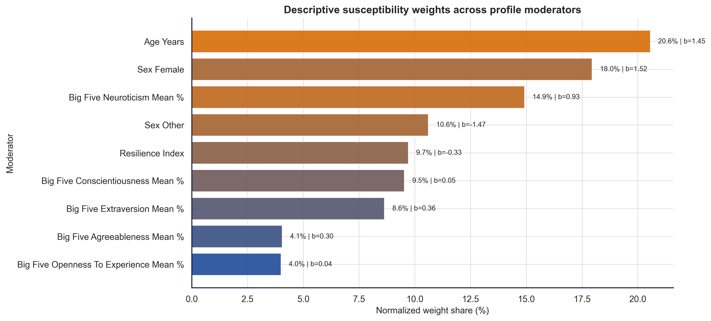
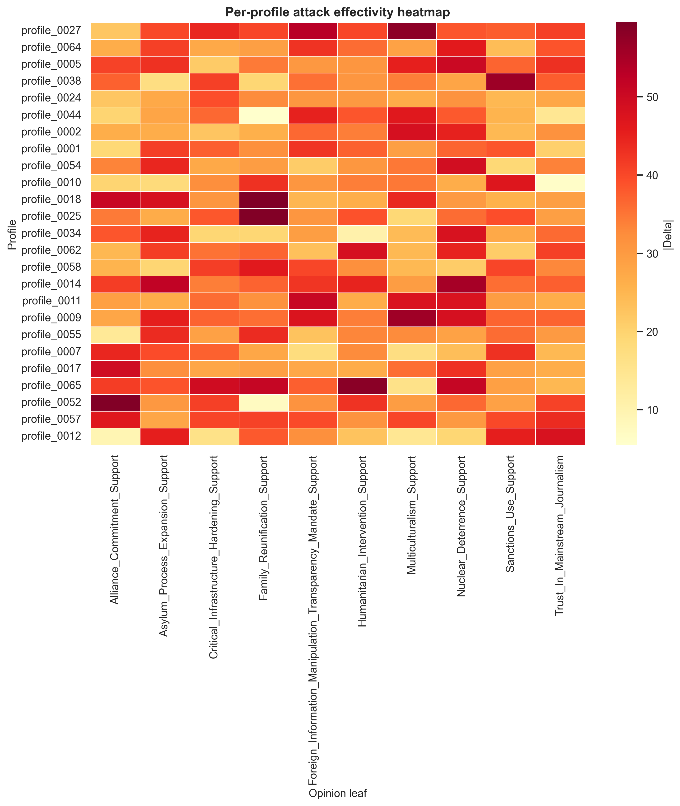
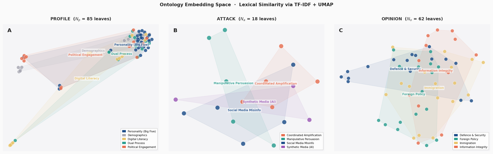
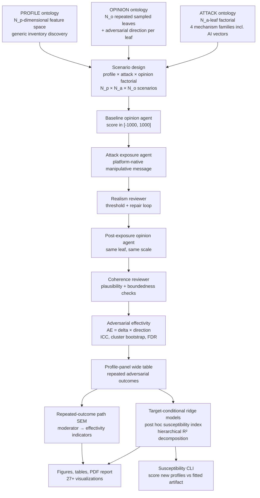

<div align="center">

# Inter-individual Differences in Susceptibility to Cyber-manipulation

### Multi-agent Simulation Approach with High-dimensional State Space of Political Opinions

[](research_report/report/main.pdf)
[](LICENSE)
[](https://www.python.org/)
[](docker/)

**Stijn Van Severen<sup>1,*</sup> · Thomas De Schryver<sup>1</sup> · Mira Ostyn<sup>1</sup>**

<sup>1</sup> Ghent University · <sup>*</sup> Corresponding author

---

</div>

## 📋 Table of Contents

- [Abstract](#-abstract)
- [Key Findings](#-key-findings)
- [Full Paper](#-full-paper)
- [Repository Structure](#-repository-structure)
- [Setup & Installation](#-setup--installation)
- [Usage](#-usage)
- [Pipeline Overview](#-pipeline-overview)
- [Conditional Susceptibility Index](#-conditional-susceptibility-index)
- [🧩 Custom Ontology Support](#-custom-ontology-support)
- [Citation](#-citation)
- [License](#-license)

> **Custom ontology guide:** See [`src/backend/user_ontology/notebook/tool_usage.ipynb`](src/backend/user_ontology/notebook/tool_usage.ipynb) for a professional guide to using custom PROFILE × ATTACK × OPINION ontologies, including step-by-step format specification, validation walkthrough, and output interpretation.

---

## 📝 Abstract

This repository contains the backend research pipeline, evaluation outputs, manuscript assets, and reproducible report for a study on how **inter-individual differences moderate the effectivity of cyber-manipulation** in political opinion spaces. The workflow represents `PROFILE`, `ATTACK`, and `OPINION` as explicit hierarchical ontologies, generates attacked-only profile-panel scenarios, elicits baseline and post-exposure opinions with structured LLM agents, audits exposure realism and response coherence, and estimates moderation through a **repeated-outcome path SEM** plus a **post hoc ridge-regularized susceptibility index**.

The present study extends an earlier single-domain design to test generalization across *N_o* opinion domains and *N_a* attack mechanisms including AI-based vectors (LLM Chatbot Personalized Persuasion, Deepfake Audio Speech Impersonation).

> **Interpretive constraint:** Among attacked pseudoprofiles, which profile differences are associated with larger post-minus-baseline opinion shifts — in the direction of a hypothetical adversary's goal — across repeated political opinion leaves and multiple attack mechanisms? The design is attacked-only: it does **not** estimate a no-attack counterfactual effect.

---

## Key Findings

> **Main result:** The full-factorial design used *N_p* = **80 pseudoprofiles** crossed with *N_a* = **6 attack vectors** and *N_o* = **8 opinion leaves** across 4 political domains. Attack vectors span four mechanism families: cognitive reframing, emotional manipulation, false consensus, authority heuristic exploitation, and two AI-based vectors. The primary effectivity outcome is **adversarial effectivity** (*AE*): the signed opinion delta multiplied by each opinion leaf's pre-assigned adversarial goal direction.

### Headline Results

| Metric | Value |
|--------|-------|
| *N* (attacked scenarios) | *N_p* × *N_a* × *N_o* = **3,840** |
| Profile feature dimensions | 85 (Big Five + Dual Process + Digital Literacy + Political Engagement + demographics) |
| Mean \|Δ\| | 34.75 (*SD* = 20.19) |
| Mean *AE* | −0.84 (*SD* = 40.18) |
| Positive *AE* rate | 48.2% |
| ICC(1) | 0 across all outcomes |
| OLS overall fit | *R*² = 0.151, *F*(8,71) = 1.612, *p* = .137 (non-significant) |
| Only nominally significant moderator | Extraversion (*β* = +1.61, *p* = .023, bootstrap 95% CI [0.47, 3.00]) |
| Conscientiousness | *β* = −1.06, *p* = .159 (non-significant; sign retained from single-domain predecessor) |
| SEM fit | CFI = 1.000, RMSEA = 0.000 |

### Methodological Position

- **Full-factorial multi-domain design**: *N_a* attack leaves × *N_o* opinion leaves per profile across 4 political domains — enables cross-attack and cross-domain comparison of susceptibility moderators
- Effectivity is **directional**: each opinion leaf carries an adversarial goal direction (`±1`); `AE = signed_delta × direction`
- The SEM is a **profile-level repeated-outcome path model** with multiple adversarial effectivity indicators
- The susceptibility index is computed **post hoc** from target-conditional ridge task models with **hierarchical R² decomposition**
- **Cluster bootstrap** at the profile level (B = 600) preserves within-profile dependence in inference
- Fully auditable provenance across all 9 pipeline stages

### Main Results

<div align="center">


*Figure 1. OLS moderation model: profile-level predictors of adversarial effectivity aggregated across all N_a × N_o attack–opinion task combinations. Error bars show bootstrap 95% CIs (B = 600, profile-level block resampling). Markers indicate FDR-adjusted significance. Extraversion nominally significant (β = +1.61, p = .023); no predictor survives FDR at α = .05.*
</div>

<div align="center">


*Figure 2. Profile × opinion adversarial effectivity heatmap. Rows = profiles (N_p), columns = opinion leaves (N_o × N_a collapsed), color = mean adversarial effectivity. Low between-profile variance (ICC ≈ 0) is visible as low contrast across rows.*
</div>

---

### Ontology Embedding Space

All *N_p* + *N_a* + *N_o* leaves are embedded via TF-IDF of leaf names + UMAP projection, coloured by primary ontology node. Convex hulls delineate semantic clusters.

<div align="center">


*Figure 3. Lexical-semantic UMAP embedding of all ontology leaves. Panel A — PROFILE (N_p-dimensional feature space); Panel B — ATTACK (N_a leaves across four mechanism families); Panel C — OPINION (N_o leaves × 4 political domains). Colour = primary node; convex hulls = cluster boundaries.*
</div>

---

## 📖 Full Paper

- **PDF (typeset):** [research_report/report/main.pdf](research_report/report/main.pdf)
- **LaTeX source:** [research_report/report/main.tex](research_report/report/main.tex)
- **Paper assets:** [research_report/assets](research_report/assets)
- **Interactive dashboard:** generated locally at `evaluation/<run_id>/stage_outputs/07_generate_research_visuals/interactive_sem_dashboard.html` (excluded from git — run the pipeline to produce)

---

## 📁 Repository Structure

```text
Paper_CaseStudiesAnalysisExperimentalData/
├── README.md
├── LICENSE
├── CITATION.cff
├── requirements.txt
├── .env.example
├── .gitignore
│
├── docker/
│   ├── Dockerfile
│   ├── docker-compose.yml
│   └── entrypoint.sh
│
├── evaluation/
│   ├── run_1/ … run_8/                  # Earlier design iterations
│   └── run_9/                           # Current study: N_p × N_a × N_o = 3,840 scenarios
│
├── research_report/
│   ├── assets/
│   │   ├── figures/                     # PNG/PDF manuscript figures
│   │   └── tables/                      # CSV/TeX manuscript tables
│   └── report/
│       ├── main.tex
│       ├── references.bib
│       └── main.pdf
│
├── docs/
│   └── NEXT_STEPS.md                    # Future directions: ML, XAI, simulation realism
│
└── src/
    ├── backend/
    │   ├── agentic_framework/           # OpenRouter client, agents, prompts, repair logic
    │   ├── ontology/
    │   │   └── separate/
    │   │       └── test/                # PROFILE (85 dims) / ATTACK (18) / OPINION (62) ontologies
    │   ├── pipeline/
    │   │   ├── full/                    # Full orchestration entrypoint
    │   │   └── separate/               # Independently runnable stages 01–09
    │   ├── user_ontology/              # Plug in custom JSON ontology triplets
    │   │   ├── validator.py            # Structural + semantic validation
    │   │   ├── cli.py                  # CLI: --profile-json --attack-json --opinion-json
    │   │   └── notebook/tool_usage.ipynb   # Comprehensive guide (12 sections)
    │   └── utils/
    │       ├── conditional_susceptibility.py   # Ridge CSI + bootstrap CIs + group XAI
    │       ├── semantic_embedding.py           # TF-IDF/UMAP ontology embedding
    │       └── visualization_dashboard.py      # Interactive Plotly dashboard
    └── scripts/
        └── run_9.sh                    # Reproduce current study end-to-end
```

---

## ⚙️ Setup & Installation

### 🔧 Option A — Local

```bash
git clone https://github.com/stvsever/research_paper_on_cognitive_sovereignity.git
cd research_paper_on_cognitive_sovereignity
python3.12 -m venv .venv && source .venv/bin/activate
pip install --upgrade pip && pip install -r requirements.txt
cp .env.example .env   # add OPENROUTER_API_KEY
```

### 🐳 Option B — Docker

```bash
git clone https://github.com/stvsever/research_paper_on_cognitive_sovereignity.git
cd research_paper_on_cognitive_sovereignity
cp .env.example .env   # add OPENROUTER_API_KEY
cd docker
OPENROUTER_MODEL=mistralai/mistral-small-3.2-24b-instruct docker compose up --build
```

By default, the Docker entrypoint runs the current study configuration (N_p × N_a × N_o factorial design).

---

## 🧩 Custom Ontology Support

Cybersecurity analysts can run the full pipeline with **their own PROFILE × ATTACK × OPINION taxonomies** (3 JSON files):

```bash
# Validate your ontologies
python -m src.backend.user_ontology.cli \
  --profile-json path/to/profile.json \
  --attack-json  path/to/attack.json  \
  --opinion-json path/to/opinion.json \
  --validate-only

# Run with custom ontologies
python -m src.backend.user_ontology.cli \
  --profile-json path/to/profile.json \
  --attack-json  path/to/attack.json  \
  --opinion-json path/to/opinion.json \
  --run-id my_analysis \
  --n-profiles 40 \
  --openrouter-model mistralai/mistral-small-3.2-24b-instruct
```

See [`src/backend/user_ontology/notebook/tool_usage.ipynb`](src/backend/user_ontology/notebook/tool_usage.ipynb) — a 12-section professional guide covering format specification, validation, design guidelines, cost estimation, and output interpretation.

### Semantic Embedding

All ontology leaves can be embedded and projected to 2D via UMAP:

```python
from src.backend.utils.semantic_embedding import embed_ontology
artifact = embed_ontology(
    ontology_root="src/backend/ontology/separate/test",
    out_dir="evaluation/run_9/embeddings",
    n_clusters=8,
)
```

Results load automatically into the interactive dashboard (Ontologies → Semantic Embedding Space tab).

---

## 🚀 Usage

### Reproduce current study

```bash
bash scripts/run_9.sh
```

### Run the full pipeline manually

```bash
python src/backend/pipeline/full/run_full_pipeline.py \
  --output-root evaluation/run_9 \
  --run-id run_9 \
  --n-profiles 80 \
  --seed 99 \
  --attack-ratio 1.0 \
  --attack-leaves "Misleading_Narrative_Framing,Fear_Appeal_Scapegoating_Post,Astroturf_Comment_Wave,Pseudo_Expert_Authority_Cue,LLM_Chatbot_Personalized_Persuasion,Deepfake_Audio_Speech_Impersonation" \
  --max-opinion-leaves 8 \
  --use-test-ontology \
  --openrouter-model mistralai/mistral-small-3.2-24b-instruct \
  --temperature 0.15 \
  --bootstrap-samples 600 \
  --generate-visuals --export-static-figures --build-report
```

The `--attack-leaves` parameter selects a subset of *N_a* leaves from the ATTACK ontology. The pipeline creates a full factorial design: every profile is crossed with every attack and every opinion leaf → N_p × N_a × N_o scenarios.

### Run individual stages

Stages under `src/backend/pipeline/separate/` are independently runnable:

`01_create_scenarios` → `02_assess_baseline_opinions` → `03_run_opinion_attacks` → `04_assess_post_attack_opinions` → `05_compute_effectivity_deltas` → `06_construct_structural_equation_model` → `07_generate_research_visuals` → `08_generate_publication_assets` → `09_build_research_report`

---

## 🔄 Pipeline Overview



---

## 🧮 Conditional Susceptibility Index

The profile-level susceptibility index is **directional** and **conditional** on the configured (attack, opinion) target set *T*.

### Adversarial Effectivity

```
AE_ik = (post_score_ik − baseline_score_ik) × direction_k

direction_k ∈ {+1, −1, 0}  (from OPINION ontology; 0 = excluded)
```

### Conditional Index

For each task *t ∈ T*, a ridge model is fit:

```
Ê_it = β̂_0t + Σ_j β̂_jt · X_ij

S_i(T) = Σ_t  w_t · Ê_it          (reliability-weighted aggregate)
CSI_i(T) = percentile_rank(S_i(T))
w_t ∝ n_t / CV-MSE_t
```

Higher CSI = model expects opinion movement more strongly aligned with the adversary's goal for that profile under the configured *T*.

### Score a new profile

```bash
python src/backend/pipeline/separate/compute_conditional_susceptibility/score_profile.py \
  --artifact-path evaluation/run_9/stage_outputs/06_construct_structural_equation_model/conditional_susceptibility_artifact.json \
  --age 34 --sex Male --neuroticism-pct 75 --conscientiousness-pct 20 --extraversion-pct 85
```

---

## 📖 Citation

### APA 7

> Van Severen, S., De Schryver, T., & Ostyn, M. (2026). *Inter-individual differences in susceptibility to cyber-manipulation: A multi-agent simulation approach with high-dimensional state space of political opinions*. Ghent University. https://github.com/stvsever/research_paper_on_cognitive_sovereignity

### BibTeX

```bibtex
@article{vanseveren2026cybersusceptibility,
  title     = {Inter-individual Differences in Susceptibility to Cyber-manipulation:
               A Multi-agent Simulation Approach with High-dimensional State Space
               of Political Opinions},
  author    = {Van Severen, Stijn and De Schryver, Thomas and Ostyn, Mira},
  year      = {2026},
  institution = {Ghent University},
  url       = {https://github.com/stvsever/research_paper_on_cognitive_sovereignity}
}
```

A machine-readable citation is also available in [`CITATION.cff`](CITATION.cff).

---

## 📜 License

This project is licensed under the **MIT License** — see the [LICENSE](LICENSE) file for details.

---

<div align="center">

Built at **Ghent University** for the course *Case Studies in the Analysis of Experimental Data*

</div>
