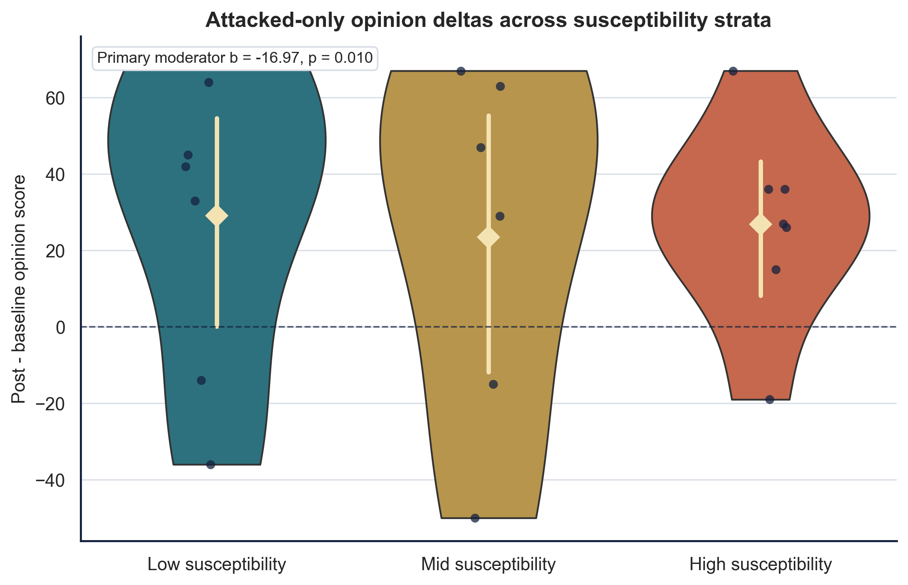
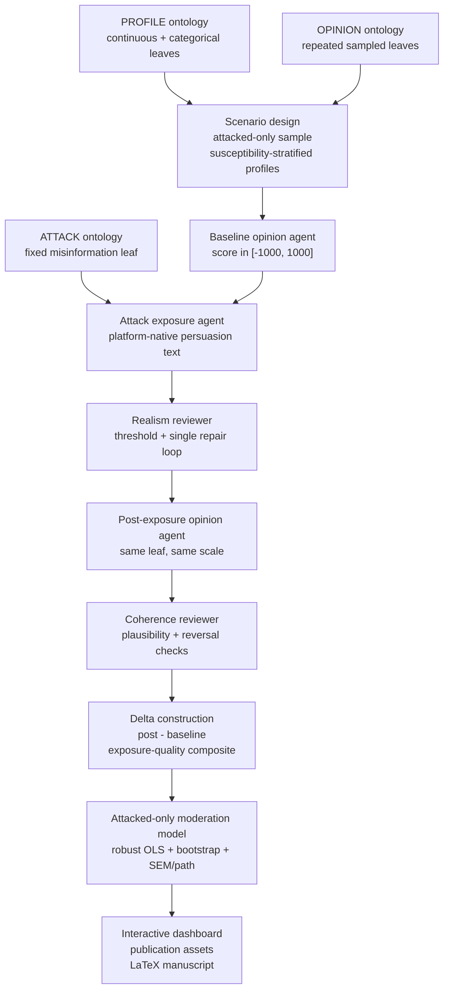

<div align="center">

# PILOT: Inter-individual Differences in Susceptibility to Cyber-manipulation

### Multi-agent Simulation Approach with High-dimension State Space of Political Opinions

[](research_report/report/main.pdf)
[](LICENSE)
[](https://www.python.org/)
[](docker/)

**Stijn Van Severen<sup>1,*</sup> · Thomas De Schryver<sup>1</sup>**

<sup>1</sup> Ghent University · <sup>*</sup> Corresponding author

**Paper License:** MIT · **Python:** 3.11+ · **Containerization:** Docker

---

</div>

## 📋 Table of Contents

- [Abstract](#-abstract)
- [Key Pilot Findings](#-key-pilot-findings)
- [Full Paper](#-full-paper)
- [Repository Structure](#-repository-structure)
- [Setup & Installation](#-setup--installation)
- [Usage](#-usage)
- [Pipeline Overview](#-pipeline-overview)
- [Figures & Tables](#-figures--tables)
- [Citation](#-citation)
- [License](#-license)

---

## 📝 Abstract

This repository contains the backend research pipeline, evaluation outputs, manuscript assets, and reproducible pilot report for a study on how **inter-individual differences may moderate susceptibility to cyber-manipulation** in political opinion spaces. The workflow represents `PROFILE`, `ATTACK`, and `OPINION` as explicit hierarchical ontologies, generates ontology-constrained attacked scenarios, elicits baseline and post-exposure opinions with structured LLM agents, audits exposure realism and response coherence, and estimates moderation through an attacked-only path model supplemented by robust regression and bootstrap intervals.

The present codebase is a **methodological pilot**, not a claim-ready population study. Its purpose is to validate the research architecture end to end: leaf-only ontology sampling, mixed-type profile construction, realistic adversarial message generation, repeated-leaf opinion design, attacked-only moderation estimation, interactive SEM inspection, publication-asset export, and automated LaTeX manuscript compilation.

> **Interpretive constraint:** `run_5` answers a narrower and cleaner question than the earlier treatment-control pilots: **among attacked individuals, which profile differences predict larger post-minus-baseline opinion shifts?** It does **not** estimate a no-attack counterfactual effect.

---

## 🔬 Key Pilot Findings

> **Main pilot result (`run_5`):** with an attacked-only design (`n = 20`) focused on `Defense_and_National_Security`, the pipeline produced a mean opinion delta of **+26.6**, mean attack realism **0.70**, and mean post-exposure plausibility **0.62**. The primary susceptibility moderator was **negative and statistically supported** in the robust delta model (`b = -16.97`, `p = .010`), with a bootstrap `95%` interval of **[-29.78, -1.03]**. The attacked-only SEM/path model converged, with display-capped fit indices of **CFI = 1.000** and **RMSEA = 0.000**.

### Why `run_5` Is Methodologically Stronger

- the design now matches the stated research question: moderation of **post-baseline change after attack**, not attack-versus-no-attack contrast
- all `run_5` scenarios are attacked with the **same misinformation vector family**, reducing attack-side heterogeneity
- repeated opinion leaves within one policy domain improve interpretability and reduce issue drift
- realism and coherence are explicitly audited before downstream estimation
- the main model controls for baseline score, baseline extremity, exposure quality, and opinion-leaf fixed effects

### Current Pilot Outputs

- `evaluation/run_1/`: initial backend pilot with mixed-condition moderation reporting
- `evaluation/run_2/`: realism/coherence upgrades plus interactive HTML SEM dashboard
- `evaluation/run_3/`: first publication-asset bundle and compiled manuscript
- `evaluation/run_4/`: transitional redesign pilot
- `evaluation/run_5/`: current attacked-only pilot aligned to the moderation question
- `research_report/report/main.pdf`: compiled manuscript generated from the current pilot outputs
- `research_report/assets/`: paper-ready figures and tables copied from the pipeline

### `run_5` Configuration Snapshot

- `20` attacked scenarios
- `1` fixed ATTACK leaf: `ATTACK_VECTORS > Social_Media_Misinformation > Misleading_Narrative_Framing`
- `4` repeated OPINION leaves within `Defense_and_National_Security`
- susceptibility-stratified profile selection from an oversampled candidate pool
- live OpenRouter execution with structured outputs, repair loops, and stored provenance
- attacked-only moderation model with robust OLS, bootstrap intervals, and SEM/path reporting

### Main Figures

<div align="center">


*Figure 2. Attacked-only opinion-delta distribution across susceptibility strata in `run_5`. Raw points, violin densities, and mean markers show how post-minus-baseline movement varies over the pre-registered susceptibility moderator.*
</div>

<div align="center">


*Figure 4. Annotated attacked-only path model from `run_5`, showing baseline anchoring, baseline extremity, exposure quality, the primary susceptibility moderator, and opinion-leaf fixed effects.*
</div>

---

## 📖 Full Paper

The manuscript is built directly from the pipeline outputs:

- **PDF (typeset):** [research_report/report/main.pdf](research_report/report/main.pdf)
- **LaTeX source:** [research_report/report/main.tex](research_report/report/main.tex)
- **Report summary:** [research_report/report/report_summary.json](research_report/report/report_summary.json)
- **Paper assets:** [research_report/assets](research_report/assets)
- **Interactive dashboard (`run_5`):** [evaluation/run_5/visuals/interactive_sem_dashboard.html](evaluation/run_5/visuals/interactive_sem_dashboard.html)

---

## 📁 Repository Structure

```text
Paper_CaseStudiesAnalysisExperimentalData/
├── README.md
├── LICENSE
├── CITATION.cff
├── requirements.txt
├── .env.example
├── .gitignore
│
├── docker/
│   ├── Dockerfile
│   ├── docker-compose.yml
│   └── entrypoint.sh
│
├── evaluation/
│   ├── run_1/                        # Initial mixed-condition pilot
│   ├── run_2/                        # Realism/coherence upgrades + dashboard
│   ├── run_3/                        # First publication bundle
│   ├── run_4/                        # Transitional redesign pilot
│   └── run_5/                        # Current attacked-only pilot
│
├── research_report/
│   ├── assets/
│   │   ├── figures/                  # PNG/PDF manuscript figures
│   │   └── tables/                   # CSV/TeX manuscript tables
│   └── report/
│       ├── main.tex
│       ├── references.bib
│       └── main.pdf
│
└── src/
    ├── backend/
    │   ├── agentic_framework/        # OpenRouter client, agents, prompts, repair logic
    │   ├── ontology/
    │   │   └── separate/
    │   │       └── test/             # PROFILE / ATTACK / OPINION test ontologies
    │   ├── pipeline/
    │   │   ├── full/                 # Full orchestration entrypoint
    │   │   └── separate/             # Independently runnable stages 01-09
    │   ├── utils/                    # Ontology, SEM, visualization, and report utilities
    │   └── requirements.txt
    └── frontend/                     # Reserved for later interactive UI work
```

> **Note:** the current repository is intentionally backend-first. The paper and evaluation stack are the primary products at this stage; frontend work is deferred until the attacked-only methodology is stable at larger sample sizes.

---

## ⚙️ Setup & Installation

### 🔧 Option A — Local

```bash
# 1. Clone the repository
git clone https://github.com/stvsever/research_paper_on_cognitive_sovereignity.git
cd research_paper_on_cognitive_sovereignity

# 2. Create a virtual environment
python3.11 -m venv .venv
source .venv/bin/activate

# 3. Install dependencies
pip install --upgrade pip
pip install -r requirements.txt

# 4. Configure the environment
cp .env.example .env
# Add your OPENROUTER_API_KEY to .env
```

### 🐳 Option B — Docker

```bash
# 1. Clone the repository
git clone https://github.com/stvsever/research_paper_on_cognitive_sovereignity.git
cd research_paper_on_cognitive_sovereignity

# 2. Configure the environment
cp .env.example .env
# Add your OPENROUTER_API_KEY to .env

# 3. Launch the current pilot workflow
cd docker
OPENROUTER_MODEL=mistralai/mistral-small-3.2-24b-instruct docker compose up --build
```

By default, the Docker entrypoint runs the current pilot configuration for `evaluation/run_5/` and writes the manuscript outputs to `research_report/report/`.

---

## 🚀 Usage

### Run the current full pilot pipeline locally

```bash
python src/backend/pipeline/full/run_full_pipeline.py \
  --output-root evaluation/run_5 \
  --run-id run_5 \
  --n-scenarios 20 \
  --seed 415 \
  --attack-ratio 1.0 \
  --attack-leaf "ATTACK_VECTORS > Social_Media_Misinformation > Misleading_Narrative_Framing" \
  --focus-opinion-domain Defense_and_National_Security \
  --max-opinion-leaves 4 \
  --profile-candidate-multiplier 4 \
  --use-test-ontology \
  --openrouter-model mistralai/mistral-small-3.2-24b-instruct \
  --temperature 0.15 \
  --max-repair-iter 2 \
  --profile-generation-mode deterministic \
  --self-supervise-attack-realism \
  --realism-threshold 0.76 \
  --self-supervise-opinion-coherence \
  --coherence-threshold 0.76 \
  --generate-visuals \
  --export-static-figures \
  --build-report \
  --primary-moderator profile_cont_susceptibility_index \
  --bootstrap-samples 800 \
  --paper-title "PILOT: Inter-individual Differences in Susceptibility to Cyber-manipulation: A Multi-agent Simulation Approach with High-dimension State Space of Political Opinions" \
  --report-root research_report/report \
  --report-assets-root research_report/assets
```

### Run individual stages

Each stage under `src/backend/pipeline/separate/` is independently runnable:

- `01_create_scenarios`
- `02_assess_baseline_opinions`
- `03_run_opinion_attacks`
- `04_assess_post_attack_opinions`
- `05_compute_effectivity_deltas`
- `06_construct_structural_equation_model`
- `07_generate_research_visuals`
- `08_generate_publication_assets`
- `09_build_research_report`

---

## 🔄 Pipeline Overview



The current workflow is intentionally **attacked-only**. Every scenario receives the same attack-vector family, so `run_5` isolates heterogeneity in **response to attack**, not the absolute effect of attack versus no attack.

---

## 📊 Figures & Tables

Main manuscript figures are copied into `research_report/assets/figures/` and include:

- `figure_1_study_design`
- `figure_2_delta_distribution_by_susceptibility`
- `figure_3_primary_moderation_interaction`
- `figure_4_annotated_sem_path_diagram`

Supplementary manuscript figures include:

- `supplementary_figure_s1_baseline_post_scatter`
- `supplementary_figure_s2_attack_quality`
- `supplementary_figure_s3_scenario_composition`
- `supplementary_figure_s4_moderator_coefficient_forest`

Main and supplementary tables are copied into `research_report/assets/tables/` as both source `CSV` and manuscript-ready `TeX` fragments, each with a title and a `Note.` block.

Interactive inspection outputs are written to:

- `evaluation/run_2/visuals/interactive_sem_dashboard.html`
- `evaluation/run_4/visuals/interactive_sem_dashboard.html`
- `evaluation/run_5/visuals/interactive_sem_dashboard.html`

---

## 📖 Citation

If you use this code, outputs, or manuscript material, cite:

### APA 7

> Van Severen, S., & De Schryver, T. (2026). *PILOT: Inter-individual differences in susceptibility to cyber-manipulation: A multi-agent simulation approach with high-dimension state space of political opinions*. Ghent University. https://github.com/stvsever/research_paper_on_cognitive_sovereignity

### BibTeX

```bibtex
@article{vanseveren2026cognitivepilot,
  title        = {PILOT: Inter-individual Differences in Susceptibility to Cyber-manipulation: A Multi-agent Simulation Approach with High-dimension State Space of Political Opinions},
  author       = {Van Severen, Stijn and De Schryver, Thomas},
  year         = {2026},
  institution  = {Ghent University},
  url          = {https://github.com/stvsever/research_paper_on_cognitive_sovereignity}
}
```

A machine-readable citation is also available in [`CITATION.cff`](CITATION.cff).

---

## 📜 License

This project is licensed under the **MIT License**. See [LICENSE](LICENSE).

You are free to use, modify, and distribute this code for academic or commercial purposes.

---

<div align="center">

Built at **Ghent University** for a backend-first pilot on cognitive sovereignty under digital adversarial pressure.

</div>
