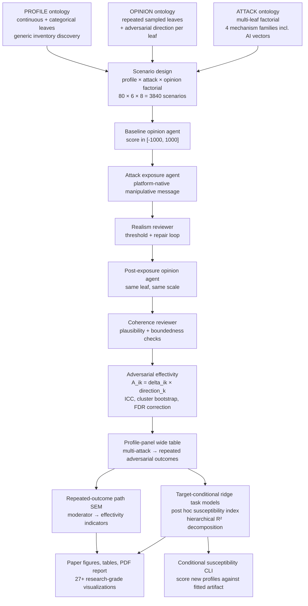

<div align="center">

# Inter-individual Differences in Susceptibility to Cyber-manipulation

### Multi-agent Simulation Approach with High-dimensional State Space of Political Opinions

[](research_report/report/main.pdf)
[](LICENSE)
[](https://www.python.org/)
[](docker/)

**Stijn Van Severen<sup>1,*</sup> · Thomas De Schryver<sup>1</sup> · Mira Ostyn<sup>1</sup>**

<sup>1</sup> Ghent University · <sup>*</sup> Corresponding author

---

</div>

## 📋 Table of Contents

- [Abstract](#-abstract)
- [Key Findings](#-key-findings)
- [Full Paper](#-full-paper)
- [Repository Structure](#-repository-structure)
- [Setup & Installation](#-setup--installation)
- [Usage](#-usage)
- [Pipeline Overview](#-pipeline-overview)
- [Conditional Susceptibility Index](#-conditional-susceptibility-index)
- [Custom Ontology Support](#-custom-ontology-support)
- [Figures & Tables](#-figures--tables)
- [Citation](#-citation)
- [License](#-license)

> **Custom ontology guide:** See `src/backend/user_ontology/notebook/tool_usage.ipynb` for a professional guide to using custom PROFILE × ATTACK × OPINION ontologies, including step-by-step format specification, validation walkthrough, and output interpretation.

---

## 📝 Abstract

This repository contains the backend research pipeline, evaluation outputs, manuscript assets, and reproducible report for a study on how **inter-individual differences moderate the effectivity of cyber-manipulation** in political opinion spaces. The workflow represents `PROFILE`, `ATTACK`, and `OPINION` as explicit hierarchical ontologies, generates attacked-only profile-panel scenarios, elicits baseline and post-exposure opinions with structured LLM agents, audits exposure realism and response coherence, and estimates moderation through a **repeated-outcome path SEM** plus a **post hoc ridge-regularized susceptibility index**.

The present study extends an earlier single-domain design (100 profiles × 4 attacks × 4 Defence-only opinion leaves) to test generalization across domains and AI-based attacks.

> **Interpretive constraint:** the current study (`run_9`) addresses the following question: **among attacked pseudoprofiles, which profile differences are associated with larger post-minus-baseline opinion shifts — in the direction of a hypothetical adversary's goal — across repeated political opinion leaves and multiple attack mechanisms, including AI-based vectors?** It does **not** estimate a no-attack counterfactual effect.

---

## Key Findings

> **Main result (`run_9`):** the extended multi-domain, AI-attack design used **80 pseudoprofiles** crossed with **6 attack vectors** and **8 opinion leaves** (`N = 3,840` attacked scenarios). Attack vectors span four mechanism families: cognitive reframing (Misleading Narrative Framing), emotional manipulation (Fear Appeal Scapegoating Post), false consensus (Astroturf Comment Wave), authority heuristic exploitation (Pseudo Expert Authority Cue), and two AI-based mechanisms (LLM Chatbot Personalized Persuasion; Deepfake Audio Speech Impersonation). The primary effectivity outcome is **adversarial effectivity**: the signed opinion delta multiplied by each opinion leaf's pre-assigned adversarial goal direction.

### Headline Results

| Metric | Value |
|--------|-------|
| N (attacked scenarios) | 3,840 (80 profiles × 6 attacks × 8 opinions) |
| Profile feature dimensions | 85 (Big Five + Dual Process + Digital Literacy + Political Engagement + demographics) |
| Mean \|Δ\| | 34.75 (*SD* = 20.19) |
| Mean adversarial effectivity (AE) | -0.84 (*SD* = 40.18) |
| Positive AE rate | 48.2% of 3,840 scenarios |
| ICC(1) | 0 across all outcomes |
| OLS overall fit | *R*² = 0.151, *F*(8,71) = 1.612, *p* = .137 (non-significant) |
| Only nominally significant moderator | Extraversion (*β* = +1.61, *p* = .023, bootstrap 95% CI [0.47, 3.00]) |
| Conscientiousness | *β* = -1.06, *p* = .159 (non-significant; sign retained from single-domain predecessor) |
| SEM fit | CFI = 1.000, RMSEA = 0.000 |

### Methodological Position

- **Multi-domain, multi-attack factorial design**: 6 distinct ATTACK leaves × 8 OPINION leaves per profile across 4 political opinion domains, enabling cross-attack and cross-domain comparison of susceptibility moderators
- Effectivity is **directional**: each opinion leaf carries an adversarial goal direction (`+1`, `-1`, or `0`); `adversarial_effectivity = signed_delta × direction`
- The **adversarial operator goal** is maximizing aggregate erosion of defense cohesion, multilateral alliance commitment, institutional security capacity, and information ecosystem integrity — expressed as per-leaf direction annotations (`+1`, `−1`) in the OPINION ontology
- The SEM is a **profile-level repeated-outcome path model** with multiple attacked effectivity indicators
- The susceptibility index is computed **post hoc** from target-conditional ridge task models with **hierarchical R-squared decomposition**
- **Cluster bootstrap** at the profile level preserves within-profile dependence in inference (B = 600)
- **ICC(1)** diagnostics for all outcome variables characterize between- vs. within-profile variance
- The pipeline produces **27+ research-grade visualizations** including baseline-to-post opinion state space transitions and per-attack comparison panels
- Fully auditable provenance: baseline scores, exposure texts, realism review, post-exposure scores, coherence review, SEM outputs, conditional susceptibility artifact

### Conditional Susceptibility Scoring CLI

Score any new pseudoprofile against the fitted study artifact:

```bash
python src/backend/pipeline/separate/compute_conditional_susceptibility/score_profile.py \
  --artifact-path evaluation/run_9/stage_outputs/06_construct_structural_equation_model/conditional_susceptibility_artifact.json \
  --age 24 --sex Female --neuroticism-pct 84 --conscientiousness-pct 22
```

The CLI outputs a full `.txt` report with hierarchical opinion-domain and feature-group breakdowns, including the profile's CSI percentile rank within the training sample.

### Main Figures

<div align="center">


*Figure 3. Descriptive susceptibility weights across profile moderators in `run_9`, showing how the post hoc susceptibility index is decomposed over age, sex, and personality terms under the modeled multi-attack/opinion target set. The primary outcome is adversarial effectivity.*
</div>

---

## 📖 Full Paper

The manuscript is built directly from the current study outputs:

- **PDF (typeset):** [research_report/report/main.pdf](research_report/report/main.pdf)
- **LaTeX source:** [research_report/report/main.tex](research_report/report/main.tex)
- **Report summary:** [research_report/report/report_summary.json](research_report/report/report_summary.json)
- **Paper assets:** [research_report/assets](research_report/assets)
- **Interactive dashboard (`run_9`):** generated locally at `evaluation/run_9/stage_outputs/07_generate_research_visuals/interactive_sem_dashboard.html` but intentionally not tracked in git to keep the repository lean

---

## 📁 Repository Structure

```text
Paper_CaseStudiesAnalysisExperimentalData/
├── README.md
├── LICENSE
├── CITATION.cff
├── requirements.txt
├── .env.example
├── .gitignore
│
├── docker/
│   ├── Dockerfile
│   ├── docker-compose.yml
│   └── entrypoint.sh
│
├── evaluation/
│   ├── run_1/                        # Initial mixed-condition design
│   ├── run_2/                        # Realism/coherence upgrades + dashboard
│   ├── run_3/                        # First publication bundle
│   ├── run_4/                        # Transitional redesign
│   ├── run_5/                        # First attacked-only design
│   ├── run_6/                        # 50-profile repeated-outcome (abs_delta_score)
│   ├── run_7/                        # 100-profile single-attack adversarial effectivity
│   ├── run_8/                        # 100-profile multi-attack factorial (4 attacks × 4 opinions, single domain)
│   └── run_9/                        # 80-profile extended study: 6 attacks (incl. AI vectors) × 8 opinions × 4 domains
│
├── research_report/
│   ├── assets/
│   │   ├── figures/                  # PNG/PDF manuscript figures
│   │   └── tables/                   # CSV/TeX manuscript tables
│   └── report/
│       ├── main.tex
│       ├── references.bib
│       └── main.pdf
│
└── src/
    ├── backend/
    │   ├── agentic_framework/        # OpenRouter client, agents, prompts, repair logic
    │   ├── ontology/
    │   │   └── separate/
    │   │       └── test/             # PROFILE (85 dims) / ATTACK (18) / OPINION (62) test ontologies
    │   ├── pipeline/
    │   │   ├── full/                 # Full orchestration entrypoint (run_full_pipeline.py)
    │   │   └── separate/             # Independently runnable stages 01–09
    │   ├── user_ontology/            # Plug in custom JSON ontology triplets
    │   │   ├── validator.py          # Structural + semantic validation
    │   │   ├── cli.py                # CLI wrapper: --profile-json --attack-json --opinion-json
    │   │   └── notebook/tool_usage.ipynb   # Jupyter notebook: custom ontology guide
    │   ├── utils/                    # Ontology, SEM, visualization, report, embedding utilities
    │   │   ├── conditional_susceptibility.py  # Ridge CSI + bootstrap CIs + EB shrinkage + group XAI
    │   │   ├── semantic_embedding.py          # UMAP of ontology leaves (text-embedding-3-large)
    │   │   └── visualization_dashboard.py     # Interactive dashboard + UMAP embedding tab
    │   └── requirements.txt
    ├── scripts/
    │   └── run_9.sh                  # Reproduce run_9 with one command
    └── frontend/                     # Reserved for later interactive UI work
```

> **Note:** the repository is intentionally backend-first. The primary deliverables are the attacked-only evaluation runs, the run_9 manuscript, and the reusable methodological pipeline.

---

## ⚙️ Setup & Installation

### 🔧 Option A — Local

```bash
# 1. Clone the repository
git clone https://github.com/stvsever/research_paper_on_cognitive_sovereignity.git
cd research_paper_on_cognitive_sovereignity

# 2. Create a virtual environment
python3.12 -m venv .venv
source .venv/bin/activate

# 3. Install dependencies
pip install --upgrade pip
pip install -r requirements.txt

# 4. Configure the environment
cp .env.example .env
# Add your OPENROUTER_API_KEY to .env
```

### 🐳 Option B — Docker

```bash
# 1. Clone the repository
git clone https://github.com/stvsever/research_paper_on_cognitive_sovereignity.git
cd research_paper_on_cognitive_sovereignity

# 2. Configure the environment
cp .env.example .env
# Add your OPENROUTER_API_KEY to .env

# 3. Launch the current study workflow
cd docker
OPENROUTER_MODEL=mistralai/mistral-small-3.2-24b-instruct docker compose up --build
```

By default, the Docker entrypoint runs the current study configuration and writes manuscript outputs to `research_report/report/`.

---

## 🔌 Custom Ontology Support

Cybersecurity analysts can run the full pipeline with **their own PROFILE × ATTACK × OPINION taxonomies** (3 JSON files):

```bash
# Validate your ontologies first
python -m src.backend.user_ontology.cli \
  --profile-json path/to/profile.json \
  --attack-json  path/to/attack.json  \
  --opinion-json path/to/opinion.json \
  --validate-only

# Run the full pipeline with your ontologies
python -m src.backend.user_ontology.cli \
  --profile-json path/to/profile.json \
  --attack-json  path/to/attack.json  \
  --opinion-json path/to/opinion.json \
  --run-id my_analysis \
  --n-profiles 40 \
  --openrouter-model mistralai/mistral-small-3.2-24b-instruct
```

See `src/backend/user_ontology/notebook/tool_usage.ipynb` for a professional guide to using custom PROFILE × ATTACK × OPINION ontologies, including step-by-step format specification, validation walkthrough, and output interpretation.

## 🔎 Semantic Embedding (UMAP)

All ontology leaves can be embedded using `text-embedding-3-large` (OpenRouter) and projected to 2D via UMAP, with KMeans cluster analysis. This reveals semantic similarity structure across PROFILE × ATTACK × OPINION leaves in a shared embedding space:

```python
from src.backend.utils.semantic_embedding import embed_ontology
artifact = embed_ontology(
    ontology_root="src/backend/ontology/separate/test",
    out_dir="evaluation/run_9/embeddings",
    n_clusters=8,
)
artifact.write("evaluation/run_9/embeddings")
```

The resulting `embedding_dashboard.json` is automatically loaded by the interactive dashboard (Ontologies → Semantic Embedding Space tab).

---

## 🚀 Usage

### Run run_9 (current)

```bash
bash scripts/run_9.sh
```

### Run the full pipeline manually

```bash
python src/backend/pipeline/full/run_full_pipeline.py \
  --output-root evaluation/run_9 \
  --run-id run_9 \
  --n-profiles 80 \
  --seed 99 \
  --attack-ratio 1.0 \
  --attack-leaves "Misleading_Narrative_Framing,Fear_Appeal_Scapegoating_Post,Astroturf_Comment_Wave,Pseudo_Expert_Authority_Cue,LLM_Chatbot_Personalized_Persuasion,Deepfake_Audio_Speech_Impersonation" \
  --max-opinion-leaves 8 \
  --profile-candidate-multiplier 5 \
  --use-test-ontology \
  --openrouter-model mistralai/mistral-small-3.2-24b-instruct \
  --temperature 0.15 \
  --max-repair-iter 2 \
  --profile-generation-mode deterministic \
  --self-supervise-attack-realism \
  --realism-threshold 0.76 \
  --self-supervise-opinion-coherence \
  --coherence-threshold 0.76 \
  --generate-visuals \
  --export-static-figures \
  --build-report \
  --bootstrap-samples 600 \
  --max-concurrency 20 \
  --paper-title "Inter-individual Differences in Susceptibility to Cyber-manipulation: A Multi-agent Simulation Approach with High-dimensional State Space of Political Opinions" \
  --report-root research_report/report \
  --report-assets-root research_report/assets
```

The `--attack-leaves` parameter accepts a comma-separated list of attack leaf names (matched case-insensitively against the ontology). The pipeline creates a full factorial design: every profile is crossed with every attack and every opinion leaf. For the configuration above: 80 profiles × 6 attacks × 8 opinions = 3,840 scenarios.

**Single-attack design (backward compatible):**

```bash
python src/backend/pipeline/full/run_full_pipeline.py \
  --output-root evaluation/run_7 \
  --run-id run_7 \
  --n-profiles 100 \
  --seed 77 \
  --attack-ratio 1.0 \
  --attack-leaf "ATTACK_VECTORS > Social_Media_Misinformation > Misleading_Narrative_Framing" \
  --focus-opinion-domain Defense_and_National_Security \
  --max-opinion-leaves 4 \
  --use-test-ontology \
  --openrouter-model mistralai/mistral-small-3.2-24b-instruct \
  --generate-visuals --export-static-figures --build-report
```

### Run individual stages

Each stage under `src/backend/pipeline/separate/` is independently runnable:

- `01_create_scenarios`
- `02_assess_baseline_opinions`
- `03_run_opinion_attacks`
- `04_assess_post_attack_opinions`
- `05_compute_effectivity_deltas`
- `06_construct_structural_equation_model`
- `07_generate_research_visuals`
- `08_generate_publication_assets`
- `09_build_research_report`

---

## 🔄 Pipeline Overview



---

## 🧮 Conditional Susceptibility Index

The profile-level susceptibility index is **directional** and **conditional** on both the attack vectors and opinion leaves being modeled.

### Adversarial Effectivity Outcome

Each opinion leaf in the OPINION ontology carries a pre-assigned adversarial goal direction:

```text
direction ∈ {+1, −1, 0}
  +1  adversary wants this opinion score to increase
  −1  adversary wants this opinion score to decrease
   0  directionally ambiguous — excluded from adversarial scoring
```

The adversarial effectivity for profile `i` on opinion leaf `k` is:

```text
adversarial_effectivity_ik = signed_delta_ik × direction_k
```

Positive adversarial effectivity means the profile's opinion moved in the direction the adversary intended. Zero-direction leaves are assigned a neutral direction of 1 (no directional contribution). This replaces raw `|Δ|` as the primary susceptibility outcome.

### Conditional Index Formulation

Let the configured target set be:

```text
T = {(attack_leaf, opinion_leaf)}
```

For each task `t in T`, the pipeline fits a regularized profile-only ridge model on observed adversarial effectivity:

```text
E_hat_it = beta_hat_0t + sum over features j of [ beta_hat_jt * X_ij ]
```

Aggregated with reliability weights and converted to percentile rank:

```text
S_i(T)   = sum over tasks t in T of [ w_t * E_hat_it ]
CSI_i(T) = percentile_rank( S_i(T) )
w_t      ∝ n_t / CV-MSE_t     (task reliability; normalized)
```

Higher `CSI_i(T)` means the fitted model expects opinion movement more strongly aligned with the adversary's goal for that profile under the configured attack/opinion target set.

### Hierarchical Feature Decomposition

The fitted task models also compute a leave-one-group-out marginal CV-R² decomposition across an ontology-aligned feature hierarchy:

- **Demographics** — age, sex
- **Personality (overall)** — all Big Five features
- **Per-trait groups** — Neuroticism, Openness, Conscientiousness, Extraversion, Agreeableness
- **Dual Process Inventory** — analytical thinking, cognitive effort
- **Digital Literacy Inventory** — critical evaluation, source triangulation
- **Political Engagement Inventory**

This decomposition answers questions like: "how much of the cross-profile susceptibility variance is explained by demographic differences versus personality trait differences versus cognitive style differences?"

### Implementation

- callable utility: [src/backend/utils/conditional_susceptibility.py](src/backend/utils/conditional_susceptibility.py)
- profile scoring CLI: [src/backend/pipeline/separate/compute_conditional_susceptibility/score_profile.py](src/backend/pipeline/separate/compute_conditional_susceptibility/score_profile.py)
- Stage 06 saves a reusable fitted artifact:
  - `conditional_susceptibility_artifact.json`
  - `conditional_susceptibility_task_coefficients.csv`
  - `conditional_susceptibility_task_summary.csv`
  - `conditional_susceptibility_hierarchical_decomposition.json`

Minimal fit-and-score usage:

```python
import pandas as pd
from src.backend.utils.conditional_susceptibility import (
    fit_conditional_susceptibility_index,
    score_profiles_with_conditional_artifact,
)

long_df = pd.read_csv("evaluation/run_9/stage_outputs/05_compute_effectivity_deltas/sem_long_encoded.csv")

fit = fit_conditional_susceptibility_index(
    long_df,
    outcome_metric="adversarial_effectivity",
    seed=42,
    compute_hierarchy=True,
)

artifact = fit.artifact
profile_scores, breakdown = score_profiles_with_conditional_artifact(
    long_df[["profile_id", *artifact.feature_columns]].drop_duplicates(),
    artifact,
)
```

Score a new profile config via the CLI:

```bash
python src/backend/pipeline/separate/compute_conditional_susceptibility/score_profile.py \
  --artifact-path evaluation/run_9/stage_outputs/06_construct_structural_equation_model/conditional_susceptibility_artifact.json \
  --config evaluation/run_9/compute_conditional_susceptibility/profile_high_susceptibility.json \
  --output-dir evaluation/run_9/compute_conditional_susceptibility/
```

Important constraint:

- the analysis-facing susceptibility construct is the post hoc **conditional susceptibility index**, not any a priori resilience proxy
- susceptibility is **conditional on the target set**: a profile can rank highly under one attack/opinion configuration and not under another

---

## 📊 Figures & Tables

Main publication figures are copied into `research_report/assets/figures/`:

- `figure_1_study_design`
- `figure_2_absolute_delta_distribution`
- `figure_3_profile_moderator_coefficient_forest`

Supplementary figures include:

- `supplementary_figure_s1_baseline_post_scatter`
- `supplementary_figure_s2_profile_effectivity_heatmap`
- `supplementary_figure_s3_susceptibility_distribution`
- `supplementary_figure_s4_attack_comparison_panel`

Main tables are copied into `research_report/assets/tables/`:

- `table_1_study_design_and_configuration`
- `table_2_attacked_effectivity_descriptive_statistics`
- `table_3_multivariate_profile_moderator_model`

Supplementary tables include:

- `supplementary_table_s1_ontology_leaves_used`
- `supplementary_table_s2_moderator_comparison`
- `supplementary_table_s3_assumption_and_risk_register`
- `supplementary_table_s4_reproducibility_manifest`
- `supplementary_table_s5_sem_path_coefficients`

The interactive dashboard for the current study is written locally to:

- `evaluation/run_9/stage_outputs/07_generate_research_visuals/interactive_sem_dashboard.html`

These generated HTML dashboards are intentionally excluded from git so the repository remains centered on the Python pipeline, manuscript assets, and evaluation datasets rather than bulky browser-rendered output files.

---

## 📖 Citation

If you use this code, outputs, or manuscript material, cite:

### APA 7

> Van Severen, S., De Schryver, T., & Ostyn, M. (2025). *Inter-individual differences in susceptibility to cyber-manipulation: A multi-agent simulation approach with high-dimensional state space of political opinions*. Ghent University. https://github.com/stvsever/research_paper_on_cognitive_sovereignity

### BibTeX

```bibtex
@article{vanseveren2025cybersusceptibility,
  title        = {Inter-individual Differences in Susceptibility to Cyber-manipulation: A Multi-agent Simulation Approach with High-dimensional State Space of Political Opinions},
  author       = {Van Severen, Stijn and De Schryver, Thomas and Ostyn, Mira},
  year         = {2025},
  institution  = {Ghent University},
  url          = {https://github.com/stvsever/research_paper_on_cognitive_sovereignity}
}
```

A machine-readable citation is also available in [`CITATION.cff`](CITATION.cff).

---

## 📜 License

This project is licensed under the **MIT License** — see the [LICENSE](LICENSE) file for details.

You are free to use, modify, and distribute this code for academic and non-academic use.

---

## Next Steps

### Ablation Studies

A rigorous ablation program is needed to isolate which components of the simulation pipeline contribute genuine measurement value and to establish the baseline against which the simulation should be compared.

**1. Simulation vs. direct one-shot elicitation (most critical ablation)**
For each profile in a matched human-data sample, collect both (a) a direct LLM susceptibility rating ("how susceptible is this profile?") and (b) the full simulation-derived CSI. Compare both against observed human opinion shifts under controlled adversarial exposure. This directly tests whether the staged multi-step pipeline produces better-calibrated, more generalizable susceptibility estimates than a scalar judgment — the central methodological claim. Without this ablation, the simulation's advantage over one-shot prompting remains asserted rather than demonstrated.

**How to implement**: Sample 50–100 real participants with matched profile features; collect baseline opinions, adversarial exposure, and post-exposure opinions on ontology-aligned items; compute observed adversarial effectivity as criterion. Compute: (i) demographics-only regression baseline, (ii) Big Five-only baseline, (iii) direct one-shot LLM rating, (iv) simulation-derived CSI. Evaluate by MAE / rank correlation against observed effectivity.

**2. Attack ontology ablation — which mechanism families drive variance?**
Hold profiles and opinions constant; systematically remove one attack family at a time (cognitive / emotional / social-proof / authority-heuristic / AI-based). Measure change in: (a) inter-profile discriminability of the susceptibility index, (b) absolute shift variance, (c) moderator effect sizes. This identifies whether all attack mechanisms contribute independent variance to susceptibility estimation or whether a leaner attack set is sufficient.

**3. Opinion-domain ablation — how domain-specific is the moderation pattern?**
Replace specific opinion domains with alternative domains (health misinformation, financial fraud, civic trust erosion). If Extraversion and Conscientiousness patterns remain stable across domains, this supports a domain-general interpretation. If moderation patterns change substantially, it indicates that susceptibility estimates are strongly domain-conditioned and cannot be generalized across opinion spaces without retraining.

**4. Profile-feature ablation — what is the minimum feature set for reliable CSI ranking?**
Systematically remove feature groups (demographics only → Big Five only → combined → full 85-dimension set) and measure degradation in test-set rank correlation of the susceptibility index. Given the non-significant full-model OLS fit, this ablation tests whether any feature combination produces reliable cross-profile discrimination, or whether prediction requires substantially larger n.

**5. LLM backend sensitivity — is susceptibility an artifact of training distribution?**
Run the same profile × attack × opinion factorial design across multiple LLM backends (e.g., Mistral, LLaMA, GPT-4o) with identical prompts and scoring. High cross-model consistency in susceptibility rankings would support construct validity; high inconsistency would indicate that susceptibility estimates reflect idiosyncratic LLM priors rather than simulated psychological dynamics.

### Scale-Up and Validation

- Expand to production ontologies with broader OPINION domains and additional ATTACK mechanism families
- Evaluate nonlinear susceptibility estimators (gradient-boosted trees, neural networks) behind the same scoring API
- Add multi-level susceptibility: attack-family-specific, opinion-domain-specific, and overall target-set scores
- Stress-test with larger profile panels (500+), more repeated opinion leaves, and cross-domain opinion transfer
- Collect human experimental data as ground-truth criterion for CSI validation (see Ablation 1 above)

### Deployment

- Stabilize the artifact contract for fitted conditional susceptibility models
- Add calibration and out-of-sample ranking diagnostics
- Increase concurrency, caching, and resumability for production-scale runs
- Build frontend dashboard for interactive susceptibility exploration

---

<div align="center">

Built at **Ghent University** 🏫 for course  '**Case Studies** in the **Analysis of Experimental Data**' 🎓

</div>
